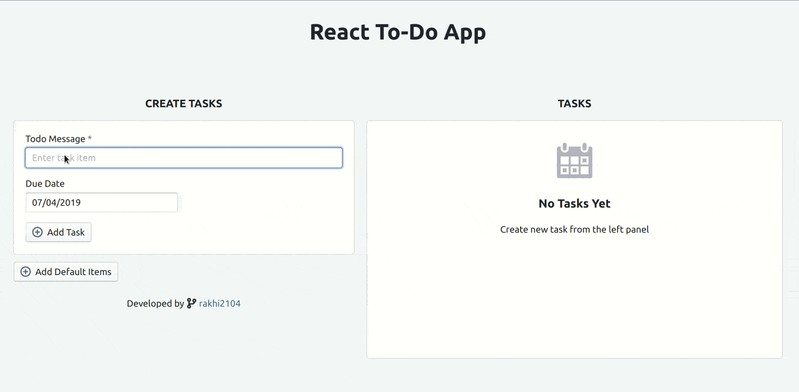

# React TODO

## Steps to run this application

- Run `npm install` in the root directory
- After all the dependencies are installed successfully, run `npm start`.
- This opens [`http://localhost:3000`](http://localhost:3000) in your default Web Browser

